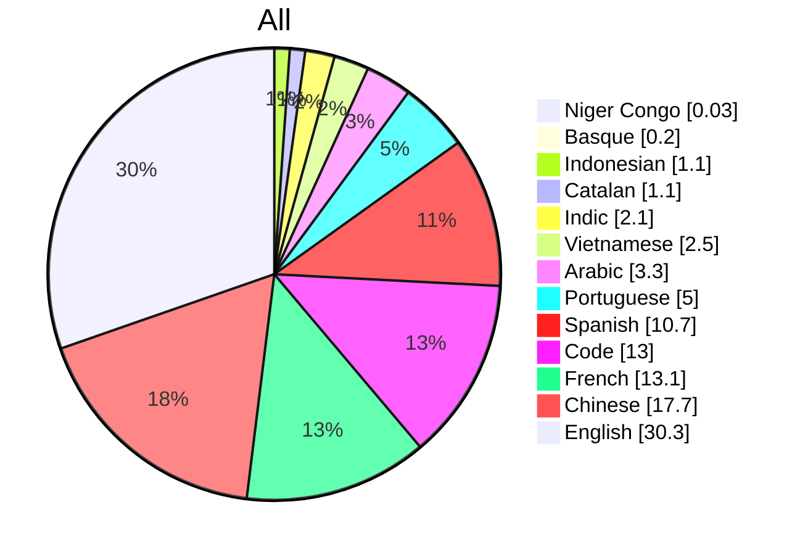
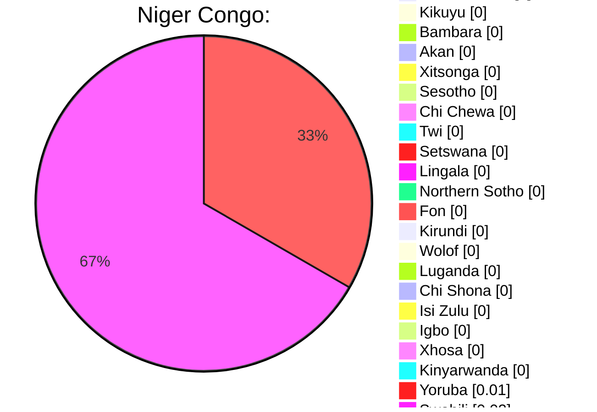
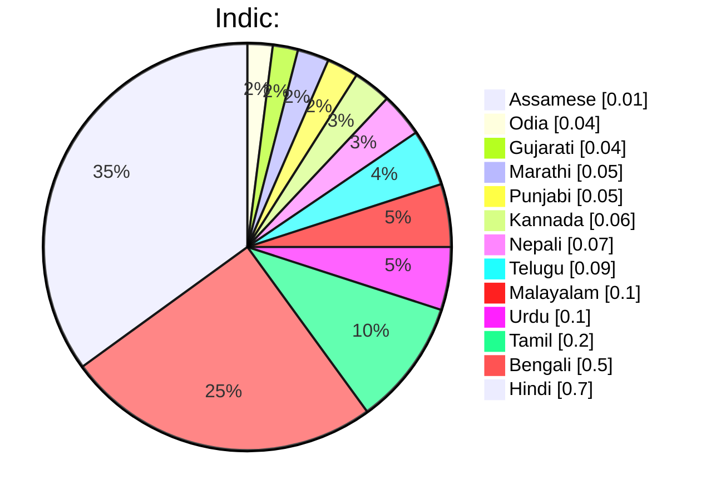

# BLOOM: BigScience Language Open-source Open-access Multilingual Model Card

## Model Details  
*This section provides basic information about what the model is, its current status, and where it comes from.*

### Basics  
**Developed by:** [BigScience](https://bigscience.huggingface.co)  
*All collaborators are either volunteers or have some type of agreement with their employer.*

**Model Type:** Transformer-based Language Model

**Version:** 1.0.0

**Languages:** Multiple; see training data.

**License:** [RAIL License v1.0](https://docs.google.com/document/d/10NMjEKjxR7mrZ5CvugGBVaF6nPEgNxFBIbkH7z5HB-0/edit#)

**Dates:** Training started 11th March, 2022 11:42am PST. Planned training end is 5th July, 2022.  In progress.

**Released:** Forthcoming

**Send questions to:** bigscience-contact@googlegroups.com

**Cite as:** [BigScience Workshop](https://bigscience.huggingface.co), BigScience Language Open-source Open-access Multilingual (BLOOM). International, May 2021-May 2022.

#### Technical Specifications

**Model Architecture:** Modified from Megatron-LM GPT2:

1.  A word embeddings layer normalization

2.  ALiBI positional encodings.

**Objective Function:** [Cross Entropy with mean reduction](https://pytorch.org/docs/stable/generated/torch.nn.CrossEntropyLoss.html#torch.nn.CrossEntropyLoss)

**Number of Parameters:** 176B parameters -- 70 layers, 112 attention heads

##### Infrastructure

Compute Infrastructure: [Jean Zay](http://www.idris.fr/eng/jean-zay/jean-zay-presentation-eng.html) Public Supercomputer, provided by the French government

Hardware: 384 A100 80GB GPUs (48 nodes)

-   Additional 32 A100 80GB GPUs (4 nodes) in reserve

-   8 GPUs per node Using NVLink 4 inter-gpu connects, 4 OmniPath links

-   CPU: AMD

-   CPU memory: 512GB per node

-   GPU memory: 640GB per node

-   Inter-node connect: Omni-Path Architecture (OPA)

-   NCCL-communications network: a fully dedicated subnet

-   Disc IO network: shared network with other types of nodes

Software:

-   [Megatron-DeepSpeed](https://github.com/bigscience-workshop/Megatron-DeepSpeed), BigScience fork

-   [DeepSpeed](https://github.com/microsoft/DeepSpeed)

-   [PyTorch](https://github.com/pytorch/pytorch)-1.11 w/ CUDA-11.5

-   [apex](https://github.com/NVIDIA/apex) 

##### Training

Checkpoint size:

-   Bf16 weights: 329GB

-   Full checkpoint with optimizer states: 2.3TB

Training throughput: About 150 TFLOP per GPU per second

Number of epochs: 1 (current target)

Estimated carbon emissions:  Forthcoming

Estimated electricity usage: Forthcoming

Estimated cost of training: Equivalent of $7-15M

Funding source: French government and individual labs of contributors.

Server training location: Ile-de-France, France

## Uses

*This section addresses questions around how the model is intended to be used, discusses the foreseeable users of the model (including those affected by the model), and describes uses that are considered out of scope or misuse of the model.*

#### Intended use

This model is being created in order to enable public research on large language models (LLMs). LLMs are intended to be used for language generation or as a pretrained base model that can be further fine-tuned for specific tasks. Use cases below are not exhaustive.

##### **Direct Use**

-   Text generation

-   Exploring characteristics of language generated by a language model.

    -   Examples: Cloze tests, counterfactuals, generations with reframings.

##### **Downstream Use**

-   Tasks that leverage language models include: Information Extraction, Question Answering, Summarization.

#### Misuse and Out-of-scope Use

*This section addresses what users ought not do with the model.*

See the  [LLM LICENSE ](https://docs.google.com/document/d/10NMjEKjxR7mrZ5CvugGBVaF6nPEgNxFBIbkH7z5HB-0/edit), Attachment A, for detailed usage restrictions. The below list is non-exhaustive, but lists some easily foreseeable problematic use cases.

##### **Out-of-scope Uses**

Using the model in [high-stakes](https://docs.google.com/document/d/1uQ_w-DlBsqAm8i_PEAs6HUVxmZ60yhfvrFDcvvMd8os/edit#bookmark=id.grey8ubq0nvg) settings is out of scope for this model.  The model is not designed for [critical decisions](https://docs.google.com/document/d/1uQ_w-DlBsqAm8i_PEAs6HUVxmZ60yhfvrFDcvvMd8os/edit#bookmark=id.5fu0y76t5a0n) nor uses with any material consequences on an individual's livelihood or wellbeing. The model outputs content that appears factual but is not correct.  

##### Out-of-scope uses include:

-   Usage in biomedical domains, political and legal domains, or finance domains.

-   Usage for evaluating or scoring individuals, such as for employment, education, or credit.

-   Applying the model for critical automatic decisions, generating factual content, creating reliable summaries, or generating predictions that must be correct.

#### **Misuse**

Intentionally using the model for harm, violating rights, or other kinds of malicious activities is a misuse of this model. This includes:

-   Spam generation

-   Disinformation and influence operations

-   Disparagement and defamation

-   Harassment and abuse
  
-   Deception

-   Unconsented impersonation and imitation

-   Unconsented surveillance 

-   Generating content without attribution to the model, as specified in the [RAIL License, Use Restrictions](https://docs.google.com/document/d/10NMjEKjxR7mrZ5CvugGBVaF6nPEgNxFBIbkH7z5HB-0/edit#heading=h.3blioxkgzsje).

#### Intended Users

##### **Direct Users**

-   General Public

-   Researchers

-   Students

-   Educators

-   Engineers/developers

-   Non-commercial entities

-   Community advocates, including human and civil rights groups

##### Indirect Users

-   Users of derivatives created by Direct Users, such as those using software with an [intended use](https://docs.google.com/document/d/1uQ_w-DlBsqAm8i_PEAs6HUVxmZ60yhfvrFDcvvMd8os/edit#heading=h.t4zedx9s7smn).

-   Users of [Derivatives of the Model, as described in the License](https://docs.google.com/document/d/117RhytMYC9HS-1NmWHEn9XBK7vJ5kdv9OcG6AV69Vec/edit#bookmark=id.pvl8781qfes3).

##### Others Affected (Parties prenantes)

-   People and groups referred to by the LLM

-   People and groups exposed to outputs of, or decisions based on, the LLM

-   People and groups whose original work is included in the LLM

## Training Data

-   Training data includes:

    -   45 natural languages and programming languages.

    -   In 1.5TB of pre-processed text, converted into 350B unique tokens.

    -   See the [Model README, Datasets for more](https://github.com/bigscience-workshop/bigscience/tree/master/train/tr11-176B-ml#datasets).

- Data Cards for each training dataset available at: [BigScienceCorpus](https://huggingface.co/spaces/bigscience/BigScienceCorpus), with the exception of OSCAR and the Niger-Congo languages.

## Risks and Limitations
*This section identifies foreseeable harms and misunderstandings.*

Model may:

-   Overrepresent some viewpoints and underrepresent others

-   Contain stereotypes
  
-   Contain personal information

-   Generate:

    -   Hateful, abusive, or violent language

    -   Discriminatory or prejudicial language

    -   Content that may not be appropriate for all settings, including sexual content.

-   Make errors, including producing incorrect information as if it were factual.

-   Generate irrelevant or repetitive outputs.
  
## Carbon Footprint

The training supercomputer, Jean Zay, uses mostly nuclear energy, and the heat generated by it is reused for heating campus housing. We are also tallying the overall carbon footprint of both training and upstream tasks, which we will report after training has been completed.

## Evaluation
  
### Factors
*The section lists the different kinds of variables that affect how this model behaves. These factors inform how the evaluation should be disaggregated in order to understand how the model works for different populations and in different contexts.*

#### **Language**

<table>

<tr><td>

| Indic     |  Percentage |
| ---       |      ---    |
| Assamese  |     0.01%   |
| Odia      |     0.04%   |
| Gujarati  |     0.04%   |
| Marathi   |     0.05%   |
| Punjabi   |     0.05%   |
| Kannada   |     0.06%   |
| Nepali    |     0.07%   |
| Telugu    |     0.09%   |
| Malayalam |     0.10%   |
| Urdu      |     0.10%   |
| Tamil     |     0.20%   |
| Bengali   |     0.50%   |
| Hindi     |     0.70%   |

</td><td>

</td></tr> </table>

| Indic     |  Percentage |
| ---       |      ---    |
| Assamese  |     0.01%   |
| Odia      |     0.04%   |
| Gujarati  |     0.04%   |
| Marathi   |     0.05%   |
| Punjabi   |     0.05%   |
| Kannada   |     0.06%   |
| Nepali    |     0.07%   |
| Telugu    |     0.09%   |
| Malayalam |     0.10%   |
| Urdu      |     0.10%   |
| Tamil     |     0.20%   |
| Bengali   |     0.50%   |
| Hindi     |     0.70%   |

### Metrics for Evaluation

Forthcoming. Includes:

| Metric             | Why chosen                                                         |
|--------------------|--------------------------------------------------------------------|
| F1                 | Standard for benchmarking                                          |
| Accuracy           | Standard for benchmarking                                          |
| Perplexity         | Standard metric for quantifying model improvements during training |
| Cross Entropy Loss | Standard objective for language models                             |

## Recommendations

*This section provides information on warnings and potential mitigations.*

-   Indirect users should be made aware when the content they're working with is created by the LLM.

-   Users should be aware of [Risks and Limitations](https://docs.google.com/document/d/1uQ_w-DlBsqAm8i_PEAs6HUVxmZ60yhfvrFDcvvMd8os/edit#heading=h.4tt8m5ymlink), and include an appropriate age disclaimer or blocking interface as necessary.

-   Models pre-trained with the LLM should include an updated Model Card.

-   Users of the model should provide mechanisms for those affected to provide feedback, such as an email address for comments.

## Evaluation Protocol

###### Describes the methods and techniques used to evaluate the model. Examples for these subsections available here.

#### Values-targeted

This evaluation is based on smaller, hand-crafted datasets that reflect different human values. Results highlight specific issues in the values embedded in a model.

#### Overview

We run three kinds of evaluation procedures. 

1.  Intrinsic: Evaluation during train time, calculated as the loss on the training datasets and perplexity per language.

2.  Zero-shot: Evaluation throughout development for architecture, scaling, and modeling information. All tests are in English.

3.  Downstream: Testing the fully trained model for different kinds of capabilities. This includes evaluation in multiple languages.

1.  Prompt-based

2.  Fine-tuned

Papers with further details include <https://openreview.net/pdf?id=rI7BL3fHIZq> (Zero-shot and Intrinsic) and _____

1.  ##### Intrinsic: Loss and Perplexity

_______

1.  ##### Zero Shot: Architecture, Scaling, and Modeling

We utilized the [Eleuther AI Evaluation Harness](https://github.com/EleutherAI/lm-evaluation-harness) (Gao et al., 2021), a framework for evaluating autoregressive language models across a variety of tasks and datasets, to compare and contrast different model approaches in English in a zero-shot setting (without fine-tuning for a specific task).

Code: 

<https://github.com/bigscience-workshop/bigscience/blob/master/evaluation/utilities/eai_lm_harness_through_training.slurm#L60>

1.  ##### Extrinsic: Downstream Tasks

Evaluation on multiple tasks, including bias testing.

Code:

[GitHub - bigscience-workshop/evaluation: Code and Data for Evaluation WG](https://github.com/bigscience-workshop/evaluation)

### Evaluation Data

Only English tested. All evaluations use the trained model directly, without further fine-tuning.

Field Description Key

| Task                          | Format                        | Capability                      | Dataset           | Eval Metric           |
|-------------------------------|-------------------------------|---------------------------------|-------------------|-----------------------|
| Question Answering            | Multiple choice               | Scientific knowledge            | arc_challenge     | Accuracy              |
| Question Answering            | Multiple choice               | Scientific knowledge            | arc_easy          | Accuracy              |
| Question Answering            | Binary                        | Open domain reasoning           | boolq             | Accuracy              |
| Causal Reasoning              | Two choice                    | Commonsense reasoning           | glue copa         | Accuracy              |
| Question Answering            | Multiple choice               | Healthcare knowledge            | headqa_en         | Accuracy              |
| Temporal Paragraph Completion | Multiple choice               | Commonsense reasoning           | hellaswag         | Accuracy              |
| Word prediction               | Free-form                     | Commonsense reasoning           | lambada           | Accuracy              |
| Question Answering            | Multiple choice               | Commonsense reasoning/knowledge | logiqa            | Accuracy              |
| Question Answering            | Multiple choice               | Math proficiency                | mathqa            | Accuracy              |
| Question Answering            | Binary                        | Temporal reasoning              | mc_taco           | Exact Match (EM) / F1 |
| Semantic Equivalence          | Two choice                    | Open domain reasoning           | glue mrpc         | Accuracy, F1          |
| Reading Comprehension         | Multiple choice               | Open domain reasoning           | superglue multirc | Exact Match (EM) / F1 |
| Question Answering            | Multiple choice               | Open domain knowledge           | openbookqa        | Accuracy              |
| Question Answering            | Two choice                    | Physical commonsense knowledge  | piqa              | Accuracy              |
| Word prediction               | Multiple choice               | Physical reasoning              | prost             | Accuracy              |
| Question Answering            | Ternary choice (yes/no/maybe) | Biomedical knowledge            | pubmedqa          | Accuracy, F1          |
| Entailment                    | Two choice                    | Open domain reasoning           | glue qnli         | Accuracy              |
| Semantic Equivalence          | Two choice                    | Commonsense reasoning           | glue qqp          | Accuracy, F1          |
| Reading Comprehension         | Multiple choice               | English proficiency             | race              | Accuracy              |
| Textual Entailment            | Two choice                    | Commonsense reasoning           | rte               | Accuracy              |
| Question Answering            | Multiple choice               | Scientific knowledge            | sciq              | Accuracy              |
| Sentiment Analysis            | Score                         |                                 | sst               | Accuracy              |
| Question Answering            | Free form                     | Open domain knowledge           | triviaqa          |  F1, Exact Match (EM) |
| Question Answering            | Knowledge Base extraction     | Open domain knowledge           | webqs             | Accuracy              |
| Word sense  disambiguation    | Two choice                    | Commonsense reasoning           | superglue wic     | Accuracy              |
| Word prediction               | Two choice                    | Open domain reasoning           | winogrande        | AUC, Accuracy         |
| Entailment                    | Two choice                    | Commonsense reasoning           | glue wnli         | Accuracy              |
| Pronoun resolution            | Two choice                    | Open domain reasoning           | wsc               | Accuracy              |

#### Bias Testing

## Evaluation Results

## More info

-   [Model architecture ](https://github.com/bigscience-workshop/bigscience/tree/master/train/tr11-176B-ml)and a [blog post](https://bigscience.huggingface.co/blog/what-language-model-to-train-if-you-have-two-million-gpu-hours) on decisions on architecture, size, shape, and pretraining duration

-   [Tensorboard during the training](https://huggingface.co/bigscience/tr11-176B-ml-logs/tensorboard#scalars&tagFilter=loss)

-   [Details on the obstacles overcome during the preparation on the engineering side](https://github.com/bigscience-workshop/bigscience/blob/master/train/tr11-176B-ml/chronicles-prequel.md) (instabilities, optimization of training throughput, many technical challenges and questions).[ For ongoing chronicles since the start of the final training see chronicles.](https://github.com/bigscience-workshop/bigscience/blob/master/train/tr11-176B-ml/chronicles.md)

-   For regular LLM training updates follow [@BigScienceLLM](https://twitter.com/BigScienceLLM)

## Glossary and Calculations

Defines common terms and how metrics are calculated

FPO

Carbon footprint estimated as TBD

...etc...

-   High-stakes settings: See "high-risk AI systems" and "unacceptable risk AI systems" in the European Union's proposed [Artificial Intelligence (AI) Act](https://artificialintelligenceact.eu/annexes/)

-   The AI Act uses a risk-based approach to categorize AI systems and outline requirements associated with AI systems in each risk category 

-   Critical decisions: See [the United States' proposed Algorithmic Accountability Act](https://www.congress.gov/117/bills/s3572/BILLS-117s3572is.pdf)

-   "Critical decisions" are defined in the context of the use of automated decision systems

-   The "[risk assessment framework](https://www.pdpc.gov.sg/-/media/files/pdpc/pdf-files/resource-for-organisation/ai/sgmodelaigovframework2.pdf)" introduced in Singapore's Model Artificial Intelligence Governance Framework

-   Detailing a commercial risk management framework for human-centric AI systems (i.e. the design and deployment of AI should protect people's interests including their safety and wellbeing).

The application of "[ethical, system and societal considerations](https://www.niti.gov.in/sites/default/files/2021-02/Responsible-AI-22022021.pdf)" explored in India's Responsible AI National Strategy

## Contributors
